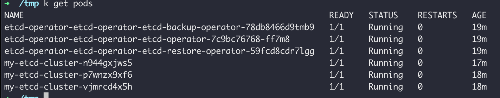

## Deploy etcd cluster using helm 
* 1. First deploy etcd operator. The etcd operator manages etcd clusters deployed to Kubernetes and automates tasks related to operating an etcd cluster.
        `helm install etcd-operator stable/etcd-operator`
* 2. Create a cluster declarative configuration
        `kubectl apply -f etcd-cluster.yaml`
* 3. Now you should see the cluster
 